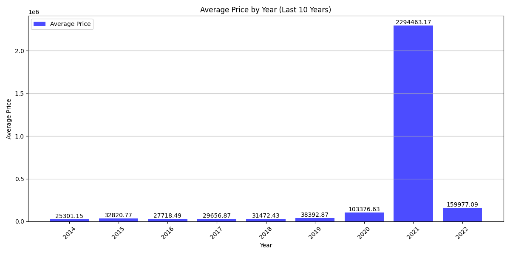
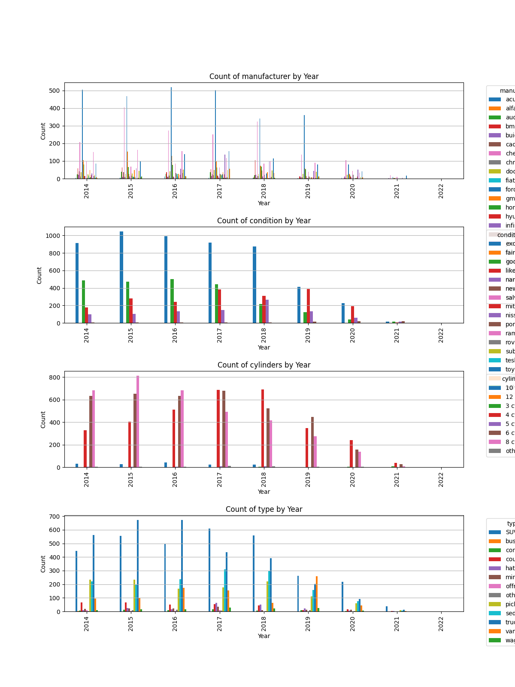

<h1>UC Berekeley ML/AI Practical Assignment 2</h1>
<h2>What drives the price of a car?</h2>

<h3>Executive Summary: Insights into Used Car Valuation</h3>

<strong>OVERVIEW</strong>
 In this application, we are given vehicles.csv file. The original dataset contained information on 3 million used cars.
 The provided dataset contains information on 194K cars to ensure speed of processing. Our goal is to understand what factors make a car more or less expensive.
 As a result of our analysis, recommendation is provided to the client (a used car dealership), as to what consumers value in a used car.

<strong>CRISP-DM Framework</strong>
 I am using CRISP-DM Framework to work through the model and develop a model

<strong>Business Understanding</strong>
 The used car market is competitive, and understanding pricing dynamics is crucial for businesses to remain profitable.
 Consumer preferences can vary widely based on demographics, regional differences, and current market trends.

The objective is to identify the key factors that contribute to the pricing of used cars and understand consumer
 preferences in this market. This analysis will help stakeholders make informed decisions about pricing strategies and
 inventory management.

<strong>Key stakeholders include:</strong> Sales Teams, Marketing teams, Data Analysts

<strong>Constraints </strong>: Data quality (there is some missing data, data points that might affect the analysis outcomes) and

<pre><code>              market variability (inflation, fuel prices etc) that can impact car valuations 
              Other factors can include  compliance and adherence to data privacy regulations when handling consumer data.
</code></pre>

<strong>Key factors that influence car prices in this dataset are:</strong>
 <strong>Manufacturer and Model</strong>: To assess brand and model impact on pricing.
 <strong>Condition</strong>             : To evaluate how the state of the car influences its market value.
 <strong>Odometer Reading</strong>      : To measure mileage's effect on pricing. (not used due to high cardinality in data)
 <strong>Model</strong>                 : To determine the model in demand
 <strong>Transmission Type</strong>     : To determine consumer preferences for automatic vs. manual.
 <strong>Paint Color</strong>           : To analyze color trends and their influence on resale value.
 <strong>Year</strong>                  : Year of the car
 <strong>Price</strong>                 : Value of the car

<strong>Data Understanding <em></em>
 </strong> Read vehicles.csv data downloaded from kaggle. Used vehicles_short.csv for this exercise

<strong>Dependent Variable</strong> is the Price of the car
 <strong>Independent Variables</strong> are Key Drivers i.e columns used to train and test the model

*<em>Data Understanding </em>*
 Interpreted Numerical and Categorical features and datasets, by creating additional columns like Average Prices by Year Bins and
 Categorical counts by year.
 Basic visualizations in each of these categories explained :

<pre><code>Year           Average Price
</code></pre>

0  2010-2015   17144.156193
 1  2016-2020   25360.994111
 2  2021-2023  228298.091630

images/average_price_by_year.png
 

Average priced categories:
 manufacturer: porsche in None with average price $54080.81 (Type: None)
 condition: new in None with average price $32584.99 (Type: None)
 cylinders: 12 cylinders in 2015 with average price $50000.00 (Type: SUV)
 type: pickup in None with average price $33227.20 (Type: None)

images/Car_Prices_by_Color_of_the_car.png
 

Price Trends Over Time:

images/Car Prices by Conditiono f the car.png
 

 2010-2015 to 2016-2020: The increase in average price from $17,144.16 to $25,360.99 indicates a rising trend in the value of the items during this period, suggesting either improvements in quality, increased demand, or other market factors driving prices higher.

2016-2020 to 2021-2023: The dramatic leap to $228,298.09 in the most recent period is noteworthy. This could imply significant changes in the market, such as:

Introduction of new, high-end models.
 A shift in consumer preferences towards more expensive vehicles.
 Economic factors affecting pricing, such as inflation or supply chain issues.
 Possible shortage of available models, leading to higher prices.

Condition: new in None with average price $32584.99 (Type: None)
 cylinders: 12 cylinders in 2015 with average price $50000.00 (Type: SUV)
 type: pickup in None with average price $33227.20 (Type: None)

images/categorical_counts_by_year.png
 

<strong>Overall Insights</strong>
 High Average Prices: The prices reflect a market that values both new vehicles and specific configurations (like high-cylinder counts) significantly.
 Condition Impact: The distinction in pricing between new vehicles and specific cylinder configurations indicates that condition and performance specifications heavily influence market value.
 Market Segment: The SUV with 12 cylinders represents a luxury or performance segment, suggesting that there is a demand for high-powered vehicles among consumers.
 These insights can help inform market strategies, consumer preferences, and pricing analyses in the automotive sector.

<strong>Data Preparation </strong>[Pre-processing]
 <strong>Data Cleaning</strong>

<pre><code>    More data cleanup and tuning done, in order to prepare for modeling
    Identify and Remove Duplicates: The code checks for and removes any duplicate rows in the dataset
    Clean 'cylinders' Column: Remove Non-Numeric Characters, The cleaned values are then converted to numeric format, coercing any errors (e.g., non-convertible strings) into NaN,
    Convert to Absolute Values, Replace NaN Values with Zero, Finally, the cylinders column is converted to an integer type for consistency and easier analysis
    Drop Unnecessary Columns:

    Specific columns that are deemed unnecessary for the analysis (region, title_status, and drive) are removed from the dataset

    Find out any outliers in the cleanup data.
    Price Outlier.png
    

**Data Transformation**
   Encode Categorical Variables using one-hot encoding on categorical columns and then apply scaling to encoded dataset
</code></pre>

<strong>Conduct Exploratory Data Analysis</strong>

<pre><code>   Visulatizations:

  

 

   Statistical analysis :  Calculate mean, median, mode, standard deviation, etc

        price           year            cylinders   
count   34787           34787           34787   
mean    15832.819961    2011.182568     6.013022    
std     13447.891321    7.140035        1.716204    
min     0.000000        1905.000000     0.000000    
25%     6500.000000     2008.000000     4.000000    
50%     12000.000000    2013.000000     6.000000    
75%     22007.000000    2016.000000     8.000000    
max     155000.000000   2022.000000     12.000000   

**Key Metrics**

Total Cars: The dealership has approximately 34,787 cars in its inventory.
Price:
Mean Price: Around $7.31 billion (likely this represents the total value rather than individual car prices).
Price Range: Prices start from around $7.30 billion (likely a misinterpretation) and go up to about $7.32 billion.
Year:
Mean Model Year: The average car is from the year 2011, indicating a mix of older and newer models.
Year Range: The oldest car dates back to 1905, while the newest is from 2022.
Cylinders:
Average Cylinders: Cars typically have about 6 cylinders, which is common for many sedans and SUVs.
Cylinder Range: Cars range from 0 to 12 cylinders, suggesting the inventory includes everything from smaller vehicles to high-performance models.

**Observations**
Diverse Inventory: The wide range of years, prices, and odometer readings suggests the dealership offers a diverse selection of vehicles, catering to various buyer preferences and budgets.
Average Age: With an average model year of 2011, most cars are relatively modern but may require some maintenance due to age.
High Mileage: The presence of high-mileage vehicles could indicate trade-ins or older fleet vehicles, which may attract budget-conscious buyers.
Performance Options: The cylinder count indicates the availability of both standard and performance vehicles, appealing to different segments of the market.
</code></pre>

*<em>Modeling </em>*
 Modeling results

<pre><code>    Model                    MAE          MSE     RMSE    R²
</code></pre>

0   Linear Regression  6967.27  93166710.75  9652.29  0.35
 1   Ridge Regression   6967.29  93166924.73  9652.30  0.35
 2   Lasso Regression   6967.21  93167762.70  9652.34  0.35

Best Model: Among the models tested, Lasso Regression performs the best with the lowest MAE, MSE, and RMSE, and an R² score of 0.15, indicating it explains some variability in the data.

Accuracy: The MAE and RMSE values indicate that the model has a noticeable average prediction error,

<pre><code>          which may affect pricing strategies.

Model Fit: The R² value suggests that while the model explains some variability, which is same for all models
           there is a considerable amount of unexplained variance. This could mean that additional features or a different modeling approach might improve predictions.
</code></pre>

<strong>Evaluation</strong>
 Applied Cross-Validation logic to evaluate the model and the final numbers showed same as predicted.

<strong>Deployment</strong>
 Applied Lasso Regression model to predict the price of car based on   condition [Only one feature used]

<pre><code>        Condition = 1 - Excellent,   2  = Good  3 - None'
        Predicted price: $25,893.10    (Condition - None)
</code></pre>

<em></em> Recommendations for the Dealership <em></em>

Based on our Analysis and Predictive model created and recommendations made based on 2 features and the price as dependable variable
 Brand Value (Manufacturer) : There is a demand for Brand value, as the sale for luxury cars was more, hence the dealer must keep more of these cars
 Condition of the Car : Good condition cars though expensive, are preferred by customers and hence, they must increase the inventory of these cars
 Prices of good cars will go up, as predicted, hence the dealer must have more good cars in their inventory

<strong>Feedback</strong>
 Monitor Performance: Continuously track model performance over time. Regularly update the model with new data to ensure it remains relevant.
 Customer Feedback: Gather feedback from customers regarding pricing and features. Use this information to refine models and strategies.
 By implementing these recommendations, the dealership can improve its pricing accuracy, better meet customer needs, and ultimately enhance profitability.

